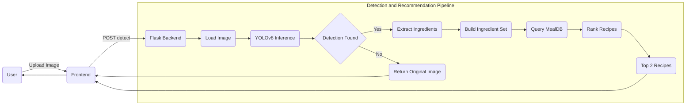
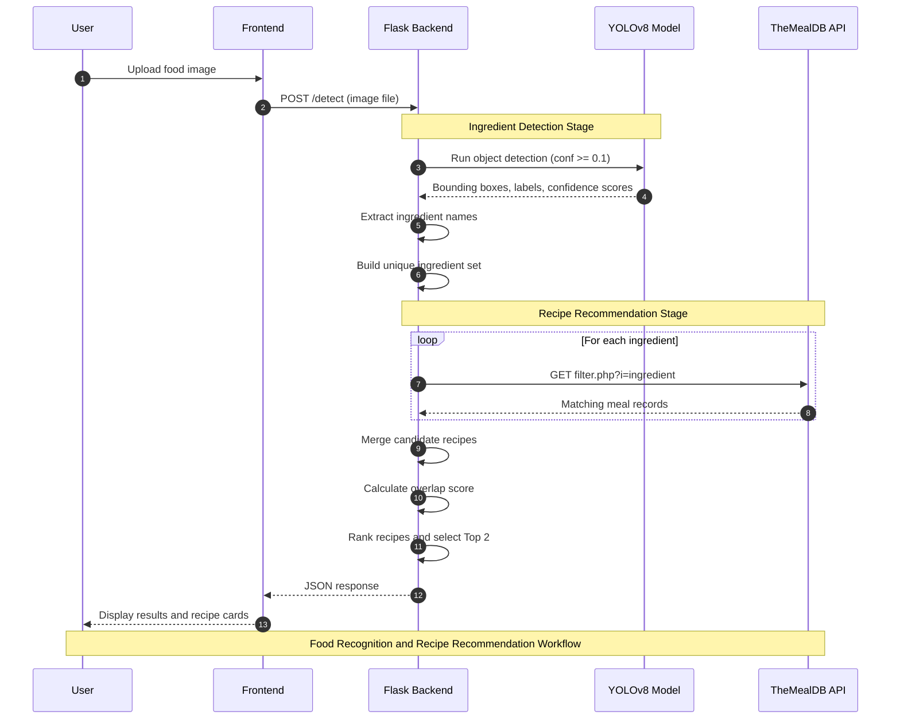
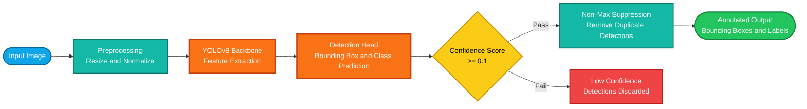

<div align="center">


<br/><br/>

# 🥦 VeggieSense AI + Recipe Finder

> **Point. Detect. Cook.**  
> Upload a photo of your vegetables and instantly get AI-powered identification with matched recipe suggestions.

<br/>

[](https://python.org)
[](LICENSE)
[](CONTRIBUTING.md)
[]()

</div>

---

## 📌 Table of Contents

- [Overview](#-overview)
- [Live Demo](#-live-demo)
- [Tech Stack](#-tech-stack)
- [System Architecture](#-system-architecture)
- [How It Works](#-how-it-works)
- [Project Structure](#-project-structure)
- [Getting Started](#-getting-started)
- [API Reference](#-api-reference)
- [Model Performance](#-model-performance)
- [Configuration](#-configuration)
- [Roadmap](#-roadmap)
- [Contributing](#-contributing)
- [Author](#-author)

---

## 🌿 Overview

**VeggieSense AI** is a full-stack computer vision web application that:

- 🔍 **Detects vegetables** in uploaded images using a fine-tuned YOLOv8 model
- 📊 **Shows confidence scores** with colour-coded probability ratings
- 🍽️ **Suggests recipes** by querying [TheMealDB API](https://www.themealdb.com/) with detected ingredients
- 🏆 **Ranks recipe matches** by the number of detected ingredients present

Built for home cooks, meal planners, and anyone who ever opened the fridge and thought *"what can I even make with this?"*

---

## 🛠️ Tech Stack

| Layer | Technology | Purpose |
|-------|-----------|---------|
| **Frontend** | HTML5, Tailwind CSS, Vanilla JS | Responsive UI, drag-and-drop upload |
| **Backend** | Python 3, Flask, Flask-CORS | REST API server |
| **ML Model** | YOLOv8 (Ultralytics) | Real-time object detection |
| **Image Processing** | OpenCV, Pillow, NumPy | Frame annotation and encoding |
| **Recipe Data** | TheMealDB REST API | Free recipe and ingredient database |
| **Packaging** | pip / requirements.txt | Dependency management |

---

## 🏗️ System Architecture



---

## 🔄 How It Works


---

## 📁 Project Structure

```
veggiesense-ai/
│
├── app.py                  # Flask application & detection logic
├── index.html              # Frontend UI (served by Flask)
├── best_epoch.pt           # Trained YOLOv8 weights  ← (not committed to repo)
├── requirements.txt        # Python dependencies
│
├── static/                 # (Optional) static assets
│   ├── images/
│   └── icons/
│
├── templates/              # Flask template folder (points to root)
│
└── README.md               # You are here
```

> ⚠️ **Note:** `best_epoch.pt` is the custom-trained model file. Due to file size, it is excluded from this repository. See [Getting Started](#-getting-started) for how to obtain or train it.

---

## 🚀 Getting Started

### Prerequisites

- Python **3.8+**
- `pip` package manager
- A modern web browser
- *(Optional)* CUDA-enabled GPU for faster inference

---

### Installation

**1. Clone the repository**

```bash
git clone https://github.com/your-username/veggiesense-ai.git
cd veggiesense-ai
```

**2. Create and activate a virtual environment**

```bash
python -m venv venv

# macOS / Linux
source venv/bin/activate

# Windows
venv\Scripts\activate
```

**3. Install dependencies**

```bash
pip install -r requirements.txt
```

**4. Add your trained model**

Place your `best_epoch.pt` file in the project root directory.

```bash
cp /path/to/your/best_epoch.pt .
```

**5. Run the server**

```bash
python app.py
```

**6. Open the app**

Navigate to [http://localhost:5000](http://localhost:5000) in your browser.

---

## 📡 API Reference

### `GET /health`

Returns the health status of the server and model.

**Response**

```json
{
  "status": "healthy",
  "model_loaded": true,
  "class_count": 30
}
```

---

### `POST /detect`

Runs object detection on the uploaded image and returns detections + recipe suggestions.

**Request**

| Field | Type | Description |
|-------|------|-------------|
| `image` | `file` | Image file (JPG, PNG) — multipart/form-data |

**Response**

```json
{
  "count": 3,
  "detections": [
    { "class": "Carrot",   "confidence": 0.9312 },
    { "class": "Broccoli", "confidence": 0.8754 },
    { "class": "Onion",    "confidence": 0.7101 }
  ],
  "annotated_image": "data:image/jpeg;base64,...",
  "search_ingredients": ["carrot", "broccoli", "onion"],
  "recipes": [
    {
      "name": "Carrot Cake",
      "mealId": "52897",
      "match_score": 2,
      "matched_ingredients": ["carrot", "onion"]
    }
  ]
}
```

**Error Response**

```json
{
  "error": "No image provided"
}
```

---

## 📊 Model Performance

> _Replace the placeholder values below with your actual training results._

### Confidence Threshold Behaviour

| Confidence | Badge Colour | Interpretation |
|-----------|-------------|----------------|
| ≥ 80% | 🟢 Green | High confidence — reliable detection |
| 50–79% | 🔵 Blue | Medium confidence — likely correct |
| 10–49% | 🟡 Yellow | Low confidence — use with caution |

### Detection Pipeline



### Recipe Ranking Logic

```mermaid
flowchart LR

    I([Detected Ingredients])

    Q["Query TheMealDB API
for Each Ingredient"]

    A["Aggregate Results
Build Unique Recipe Dictionary"]

    S["Calculate Match Score
Count Ingredient Overlap"]

    R["Rank Recipes
Sort by Descending Score"]

    T([Top 2 Recipes])

    I --> Q
    Q --> A
    A --> S
    S --> R
    R --> T

    classDef input fill:#0ea5e9,color:#fff,stroke:#0369a1,stroke-width:2px;
    classDef api fill:#10b981,color:#fff,stroke:#047857,stroke-width:2px;
    classDef process fill:#14b8a6,color:#fff,stroke:#0f766e,stroke-width:2px;
    classDef scoring fill:#f97316,color:#fff,stroke:#c2410c,stroke-width:3px;
    classDef ranking fill:#6366f1,color:#fff,stroke:#4338ca,stroke-width:2px;
    classDef output fill:#22c55e,color:#fff,stroke:#15803d,stroke-width:2px;

    class I input;
    class Q api;
    class A process;
    class S scoring;
    class R ranking;
    class T output;
```



---

## ⚙️ Configuration

Key constants in `app.py`:

| Variable | Default | Description |
|----------|---------|-------------|
| `MIN_CONFIDENCE_THRESHOLD` | `0.1` | Minimum YOLO confidence to include a detection |
| `MEALDB_API_BASE` | TheMealDB v1 URL | Base URL for recipe API calls |
| `top N recipes` | `2` | Number of recipe suggestions returned |
| `port` | `5000` | Flask development server port |

To change the confidence threshold for stricter or looser detections:

```python
# app.py — line 10
MIN_CONFIDENCE_THRESHOLD = 0.5  # Only detections ≥ 50% confidence
```

---

## 🗺️ Roadmap

- [x] YOLOv8 vegetable detection
- [x] TheMealDB recipe integration
- [x] Ranked recipe suggestions
- [x] Annotated image overlay
- [ ] Support for live webcam feed
- [ ] Mobile-first PWA version
- [ ] User accounts + saved recipes
- [ ] Nutritional info per detected vegetable
- [ ] Multi-language UI support
- [ ] Docker containerisation

---

## 🤝 Contributing

Contributions are very welcome! Here's how to get involved:

1. **Fork** the repository
2. **Create** a feature branch — `git checkout -b feature/your-feature-name`
3. **Commit** your changes — `git commit -m 'Add: description of change'`
4. **Push** to your branch — `git push origin feature/your-feature-name`
5. **Open** a Pull Request

Please follow the existing code style and include comments where helpful.

---

## 📄 License

Distributed under the **MIT License**. See [`LICENSE`](LICENSE) for full details.

---

## 👤 Author

<div align="center">

Made with 💚 by **Siddhi Virag Lad**

[](mailto:siddhi.lad@vit.edu.in)
[](https://in.linkedin.com/in/lad-siddhi)

_If you found this project useful, consider giving it a ⭐ on GitHub!_

</div>

---

<div align="center">
  <sub>Built with YOLOv8 · Flask · Tailwind CSS · TheMealDB</sub>
</div>
